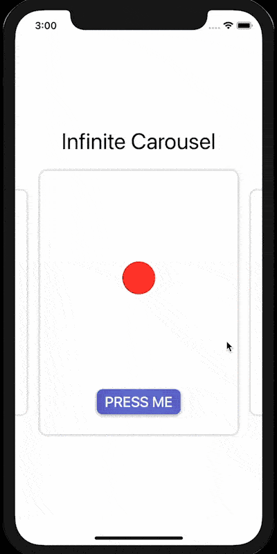

  <h1>Card Carousel</h1>
  
A package that adds carousel view to SwiftUI.

## Installation

To use this package, add it to your Xcode project as a dependency. Go to `File > Add Packages` and enter this repository’s url.

For a more detailed description of how to add packages, check out [Apple’s documentation](https://developer.apple.com/documentation/swift_packages/adding_package_dependencies_to_your_app).

<!-- ## Usage -->

## Demo

## Credit

This package was build on top Christopher Guirguis's [Infinite Carousel](https://www.youtube.com/watch?v=fB5MzDD1PZI).